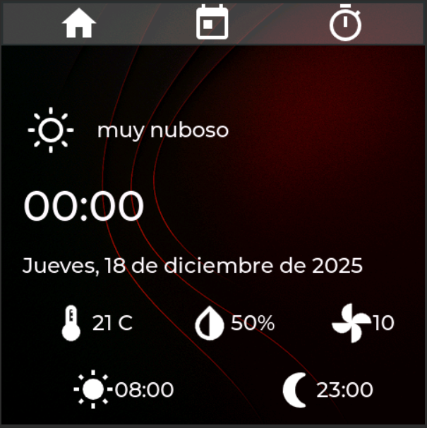
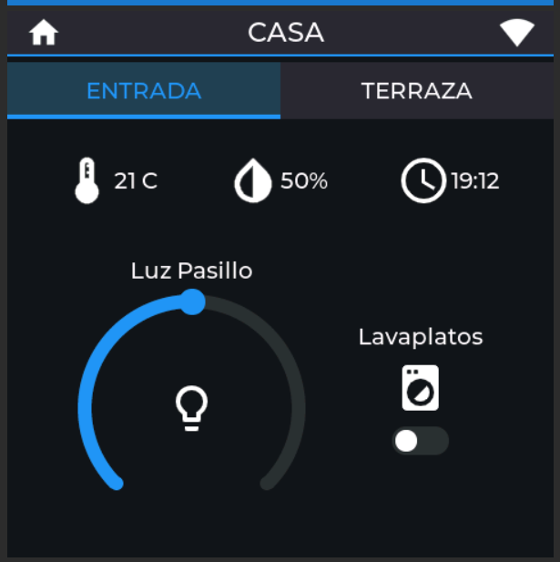
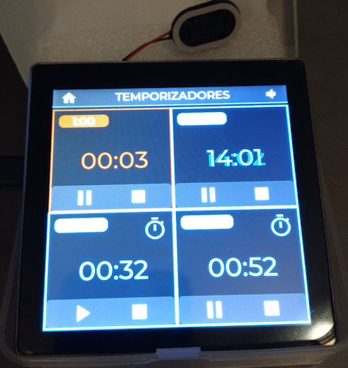
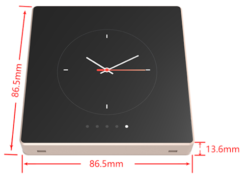
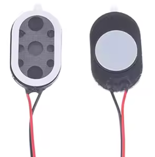
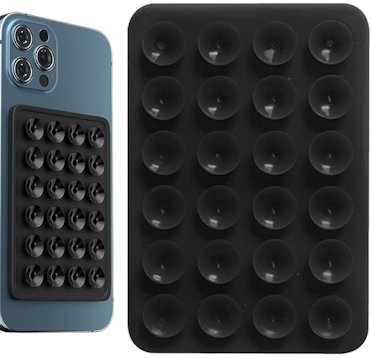
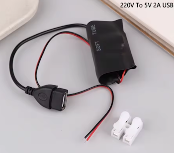
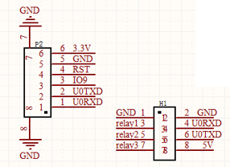
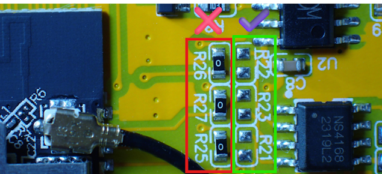
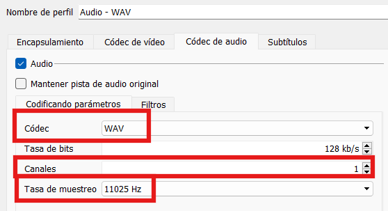

# A kitchen timer with MQTT features for home automation based on ESP32

## Contents

- [Synopsis](#synopsis)
- [Features](#features)
- [Part List](#part-list)
- [How to build one](#how-to-build-one)
- [Wifi icons](#wifi-icons)
- [Save files on FLASH](#save-files-on-flash)
- [Improvements list](#improvements-list)
- [Acknowledgements](#acknowledgements)
- [Disclaimer](#disclaimer)


## Synopsis

A kitchen timer using a Guition ESP32-4848S040 4" screen board.

All the screens are designed with [SquareLine Studio](https://squareline.io/) that exports [LGVL graphics](https://lvgl.io/). I have reduce the item number to 150 so it can be modified with the Squareline free version, but it can be expanded using LVGL on the code if needed.

<br>
<br>
<br>
*ESP32 kitchen timer*

## Features

- 4 independent timers that can be configured as timers or chronometers.
- Date and time from NTP.
- Weather prediction from OpenWeatherMap.
- 6 different alarm sounds and 3 (+muted) volume.
- MQTT connection to get and send data for home automation.

## Part list

- **Guition ESP32-4848S040**<br>
    This board has almost everything needed. Features:
    - ESP32-S3 controller (240MHz, 16Mb Flash, 8Mb PSRAM, 512Kb RAM), Wifi and Bluetooth integrated.
    - 4" (480x480) screen, 16bit RGB, 65K colors ST7701 and GT911 touch.
    - NS4168 I2S 2,3W audio amplifier
    - Battery charger controller
    - TF socket
    - USB-C

<br>
*Guition ESP32-4848S040*

- **8 ohm 1W mini speaker**<br>
    Presoldered with a MX 1.25 connector

<br>
*8 ohm 1W mini speaker*

- **~~Phone silicone suction pad.~~ Velcro double side tape**<br>
    ~~Used it to stick the screen to the side of a kitchen furniture. Maybe it is not suitable for other places because is not strong enough, but it works on smooth surfaces.~~

    Do not waste your money on this. It is not strong enough, even on smooth surfaces. I have used double-sided hook-and-loop tape.

<br>
*Phone suction pad*

- **220V to USB 2A converter**<br>
    It is small enough to placed it inside a wall plug. You can use a standard 2A USB power adapter too if you don't want to mess with your power installation.

<br>
*USB 2A power*

- **Other stuff**
    - USB-C cable.
    - Iron soldering kit.


## How to build one
Almost everything is included with the Guition module so you don't need to spend much time with a screwdriver or a hammer, but there are some tips you should know:

1. There are three versions of this Guition board, two of them come with relays. The bad news is **the pins connected to the relays are the same as you need to control the I2S audio controller**, so don't waste your money on the relay boards. If you feel creative maybe you can do something with the pins exposed on the back headers (U0_RX, U0_TX, IO9):
    

2. Second bad news is those pins are connected by default to the relays, even if your version doesn't come with them, so you must desolder three 0 ohm SMD resistances and solder to the correct place. Just take off the two screws that hold the back of the board and take it gently to see the circuit. You must move R25, R26 and R27 to R21, R22 and R23. Relax, breathe deep and remember don't drink coffee 3 hours before.
    
    *NS1468 resistors.*

3. Get your OpenWeatherMap API keys. You have to sign up on the service but the free tier should be enough.
     - https://openweathermap.org/api

3. Plug the speaker into the audio socket. Is the two pin header close to the USB-C connector.

4. Set your VCode + Platformio environment with the project from esp32-bike-computer-main folder. This step is too long to describe here and there is a lot of information on internet about how to do it :wink:
    - Create a "include/secrets.h" file and fill it with your data. E.g.:
    ```
    #ifndef _SECRETS_H_
    #define _SECRETS_H_

    #define WEATHER_APIKEY "your_openweathermap_api_key"
    #define WEATHER_CITYID "3104324"    // Zaragoza,ES Look for your location: https://www.openweathermap.org/find

    #define SEEING_SERVER       "your_server"
    #define SEEING_SERVERPORT   80

    #define WIFI_SSID   "mySSID"        // Your Wifi SSID
    #define WIFI_PASS   "myWIFIPass"    // Your Wifi password

    #define MQTT_SERVER         "192.168.1.1"       // MQTT Server IP Address
    #define MQTT_SERVERPORT     1883                // MQTT Server port
    #define MQTT_USERNAME       "mymqttusername"    // MQTT Username
    #define MQTT_PASS           "mymqttpassword"    // MQTT Password
    #define MQTT_CLIENTID       "client01"   // MQTT server Client ID
    #define MQTT_SSL_FINGERPRINT    "00 11 22 33 44 55 66 77 88 99 AA BB CC DD EE FF 00 11 22 33"       // MQTT Server SSL fingerprint

    #endif  // _SECRETS_H_
    ```

    - You should have some programming knowledge if you want you change the MQTT connection to fit your home. All that you need is on include/my_def.h, and src/mqtt.cpp functions.

    - As is documented on [github](https://github.com/moononournation/Arduino_GFX/issues/684), you need to make some changes to the library moononournation/Arduino_GFX to work with this board, otherwise you will see strange colors on your screen. For that, open "Arduino_GFX/src/display/Arduino_RGB_Display.h" file and change the following lines:
    ```
    Line 511 in 365a70b
    // WRITE_COMMAND_8, 0x21,   // 0x20 normal, 0x21 IPS 
    WRITE_COMMAND_8, 0x20,   // 0x20 normal, 0x21 IPS 

    Line 419 in 365a70b
    // WRITE_C8_D8, 0xCD, 0x08, 
    WRITE_C8_D8, 0xCD, 0x00,//0x08
    ```

    - Compile and upload it to the ESP32. 


## Wifi icons
On house screen (the one that shows MQTT data) there is a wifi icon on the top right that changes to show the state of the connection:
-  Wifi is disconnected. Could be a problem with the SSID or password. Review your "include/secrets.h" file information.
-  Wifi is connected but there are some problems with the MQTT connection. Review your "include/secrets.h" file information and/or your code if you have changed something.
-  Wifi and MQTT are connected. Congratulations.


## Save files on FLASH
All the images and sounds are saved as code on the FLASH memory, so first I converted the files (wav and png) to code. LittleFS could be used too, but I have plenty of problems using it with LVGL so I decided to use this approach.

### Images
SquareLine Studio can export the images as a char array. You only must choose "Image export mode = Source code" on your project settings. 

There is also a python script on [LVGL github repo](https://github.com/lvgl/lvgl/blob/master/scripts/LVGLImage.py) if you are not using SquareLine Studio. Eg:
```
python3 LVGLImage.py --cf RGB565 image.png --ofmt C -o image.c
```

### Sounds
Same apply for the sounds, but in this case, you must ensure the bit **sample rate is 11025 and channel mono**. You can use VLC to convert any wav file to a suitable format from "Media -> Convert". These are the settings:

Once converted you can use XXD to code into a char array:
```
xxd -i beepbeep.wav beepbeep.h
```

## Improvements list

- **Astronomy seeing**<br>
    ~~It would be great to show astronomy seeing forecast, as it shows on webpages like [Meteoblue](https://www.meteoblue.com/es/tiempo/outdoorsports/seeing/) or [ClearOutside](https://clearoutside.com/).~~

    ~~Maybe I can use this dynamic image?: https://clearoutside.com/forecast_image_small/41.65/-0.88/forecast.png~~

    Done. I had a lot of problems with the http access using ArduinoHttpClient because of the chunked and compressed communication, so I decided to download the image to a web server and serve to the ESP32 from there using this "Location" configuration on Apache:
    ```
    <Location "/seeing">
			Header unset Transfer-Encoding
			SetEnv no-gzip 1
			AddType image/png .png
			Header set Connection "close"
	</Location>

    RewriteEngine on
	RewriteCond %{HTTPS} off
	RewriteCond %{REQUEST_URI} !^\/seeing
	RewriteRule (.*) https://%{SERVER_NAME}$1 [R=301,L]
    ```
    This is the crontab that downloads the image every 10 minutes. Change the URL to match your location (latitude/longitude): 
    ```
    0,10,20,30,40,50 * * * * root /usr/bin/wget "https://clearoutside.com/forecast_image_small/41.65/-0.88/forecast.png" -O /var/www/html/seeing/forecast.png
    ```


## Acknowledgements

Many thanks to the programmers that work and maintain the libraries used on this project and the authors of the icons used:
- <https://icomoon.io/app>
- <https://m3.material.io>
- <https://demo.alessioatzeni.com/meteocons>
- <https://github.com/lvgl/lvgl>
- <https://github.com/TAMCTec/gt911-arduino>
- <https://github.com/moononournation/Arduino_GFX>
- <https://github.com/bblanchon/ArduinoJson>
- <https://github.com/sstaub/NTP>
- <https://github.com/256dpi/arduino-mqtt>
- <https://github.com/lvandeve/lodepng>


## Disclaimer

I'm not a professional programmer neither an electronics expert, I'm just making this for fun and learning.

I want to share this with the community just in case someone else finds it funny or usefull for his/her own project, I haven't got other pretensions, so please:

1. I'm pretty sure the code is not perfectly written and does not follow the standards or etiquette, it just works for me. I will be more than pleasured to hear improvements and learn.
2. I have not tested so much this thing so maybe it has some minor failures. I am happy with it but if you don't, please, don't waste your money.
3. Use at your own risk. I'm not responsible for any damage, either directly or indirect. Remember: "It works for me" is the only test I have done.
4. I would be glad to read your comments, questions, doubts, jokes, etc. and will try to answer all of them, but I have done this in my spare time that is not so much, so don't expect a quick response. My apologies in advance.